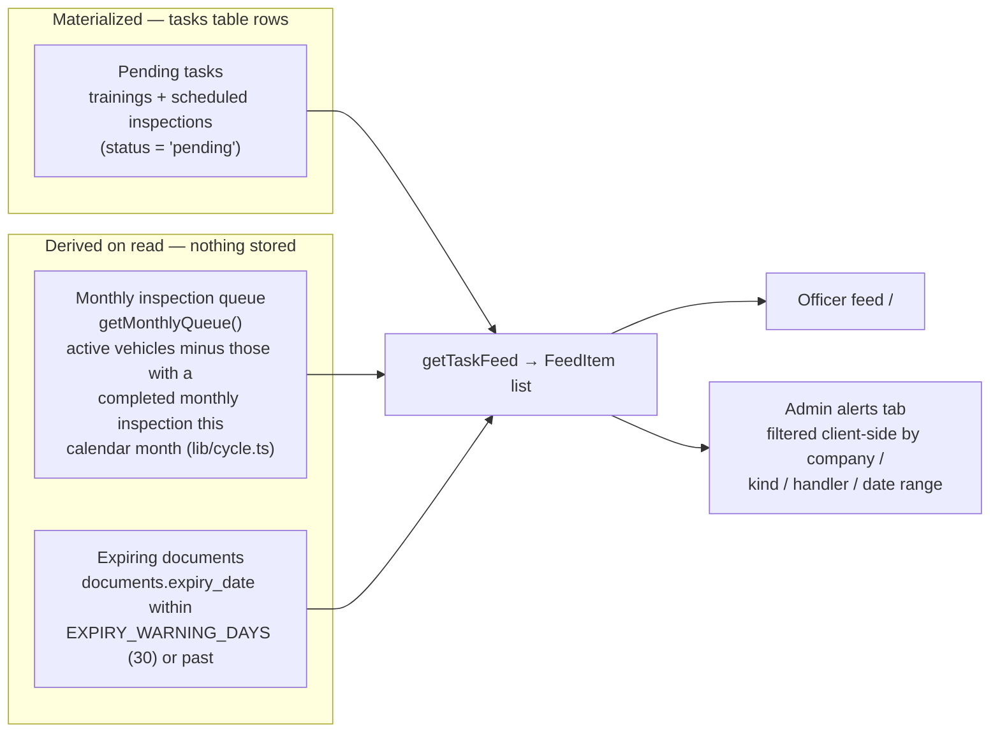

# Architecture

Deep-dive into how the Fleet Safety Officer platform works. Read the root
[README](../README.md) first for the project overview. See also:
[supabase/README](../supabase/README.md) (schema) ·
[lib/actions/README](../lib/actions/README.md) (write paths) ·
[app/README](../app/README.md) (routing).

## The two apps in one codebase

| | Officer app | Admin portal |
|---|---|---|
| Route group | `app/(app)/` | `app/admin/` |
| Audience | Safety officer in the field | Office manager at a desk |
| Layout | Mobile, `max-w-3xl` | Wide desktop, sidebar company tree |
| Access | Any authenticated user | `profiles.role === 'admin'` only |
| Purpose | Work the task feed: inspect, train, renew | CRUD everything, schedule tasks, browse per company |

Both share the same Supabase backend, server actions, and severity model.

## Auth flow (three layers)

```
Request
  └─ proxy.ts (Next 16 proxy, replaces middleware.ts)
       └─ lib/supabase/middleware.ts:updateSession()
            - refreshes the Supabase session cookie on EVERY request
            - no user + not /login  → redirect /login
            - user + /login        → redirect /
  └─ app/admin/layout.tsx (server)
       - fetches own profile; role !== 'admin' → redirect("/")
  └─ every action in lib/actions/admin.ts
       - requireAdmin() re-checks the role (defense in depth —
         layouts don't protect server actions invoked directly)
```

Login is email/password via Supabase Auth (`app/login/`). Sessions are
SSR cookies (`@supabase/ssr`); no client-side token juggling.
A `handle_new_user` DB trigger auto-creates a `profiles` row per auth user
(default role: officer).

## Alerts are HYBRID: derived + materialized (no cron anywhere)

The single most important design decision. The feed
(`lib/actions/tasks.ts:getTaskFeed`) merges three sources into one
`FeedItem[]`:



Consequences:

- **No scheduled jobs.** The monthly queue "resets" automatically because
  `currentCycleRange()` is computed at read time from the calendar month.
  Document alerts appear/disappear purely from `expiry_date`.
- **Resolving is different per source.** A derived inspection alert clears by
  submitting the inspection; a document alert clears by updating
  `expiry_date` (renew flow); a materialized task clears by setting
  `tasks.status = 'resolved'`.
- **Severity** (`lib/expiry.ts:severityFor`): past-or-missing date → `expired`
  (red), within 30 days → `warning` (amber), else `ok` (green). Used by feed
  chips, admin tables, and sort order (expired → warning → ok, then by date).

## Task lifecycle (materialized side)

```
scheduleTask (admin)  ──┐
submitTraining auto-    ├──► tasks row (status: pending) ──► shows in feed
schedule (+1 year)    ──┘                                        │
                                                                 ▼
                              officer completes linked flow (?task=<id> in URL)
                                                                 │
                                                                 ▼
                                    status: resolved  →  gone from feed
```

`tasks` rows carry `entity_type` (vehicle/driver), `entity_id`, `task_type`
(inspection/training/document), optional `template_id` (which checklist), and
`due_date`. The feed builds the target href from these
(`/inspect/…?task=…&template=…` or `/train/…?task=…`).

## Checklists are DB-driven, default Pass

`checklist_templates.items` is a jsonb array of `{key, label}`. The inspection
wizard (`components/InspectionWizard.tsx`) renders whatever the template
contains — there is **no hardcoded checklist**. Every item starts as *Pass*;
the officer only flips failures (which reveal notes + defect-photo upload).
The template with `type = 'monthly'` is what the monthly queue counts —
completing a non-monthly inspection does NOT clear a vehicle from the
monthly queue.

## doc_types: the treatment taxonomy

`doc_types` mirrors the legacy program's "טיפולים" catalog: name, entity type
(vehicle/driver), and `recurrence_months`. When a document has a
`doc_type_id` whose type has a recurrence, the renew flow pre-fills the next
expiry as *today + N months* (officer can override). Rows with null
recurrence (e.g. תיק נהג) are one-off documents. Manage the catalog at
`/admin/settings/doc-types` — never hardcode document types in code.

## Signatures

Drawn on `components/SignaturePad.tsx` (canvas) and stored as **base64
data-URL text** directly in table columns — not in Storage. The officer saves
a reusable signature once in `/profile` (`profiles.signature_url`); trainings
auto-append it (training fails with a Hebrew error if it's missing).
Inspections capture both officer + driver signatures live.

## Storage buckets

| Bucket | Visibility | Written by | Contents |
|---|---|---|---|
| `defect-photos` | public | inspection wizard | failed-item photos, `<uuid>.<ext>` |
| `documents` | private | renew flow + admin saveDocument | document scans, `<docId>/<uuid>.<ext>` or `<entityType>/<entityId>/<uuid>.<ext>` |
| `vehicle-docs` | private | (legacy phase 1) | older vehicle docs |

## The מטפל אחראי (handler) model

`handler_id` (→ `profiles.id`) exists on companies, vehicles, and drivers —
mirroring the legacy program where each entity has a responsible person.
`FeedItem.handlerId` resolves driver-handler first, then vehicle-handler.
The admin alerts tab filters by handler client-side (`AlertsPanel`).

## Revalidation model

Server actions call `revalidatePath("/")` (officer flows) or
`revalidatePath("/", "layout")` (admin flows — invalidates everything since
admin edits affect many pages). All admin/feed pages export
`const dynamic = "force-dynamic"`; nothing user-specific is statically cached.

## Conventions & gotchas

- **Schema changes touch two places**: `supabase/migrations/*.sql` AND
  `lib/types.ts`. Always together. See [supabase/README](../supabase/README.md).
- **Next.js 16**: `params`/`searchParams` are Promises — `await` them.
  `proxy.ts` (export `proxy`), not `middleware.ts`. Check
  `node_modules/next/dist/docs/` before writing Next-specific code.
- **RLS is deliberately permissive** (all authenticated users, full access)
  because this is a small internal team; admin-ness is enforced in the app
  layer, not RLS. Don't "fix" the advisors' permissive-RLS warnings.
- **Hebrew-first RTL**: the root layout sets `dir="rtl"`; `text-left` in
  Tailwind therefore means the *end* of a row visually.
- **Tests are Vitest + React Testing Library** (`vitest.config.ts`, jsdom,
  `*.test.ts(x)` next to their source). Verification is `npm run lint` +
  `npm test` + `npm run build`, backed by CI (`.github/workflows/ci.yml`), plus
  manually driving the flows (see docs/MAINTENANCE.md).
